# argocd-gitops-platform

Déploiement continu GitOps sur un cluster Kubernetes kubeadm avec Argo CD : le dépôt Git est l'unique source de vérité, et Argo CD aligne en continu le cluster sur son contenu (synchronisation automatique, self-heal, prune, rollback par `git revert`).

> **Statut :** projet en cours de construction (Phase 7 terminée — scénarios GitOps rejoués et documentés).

## Environnement

| Élément | Valeur |
| ------- | ------ |
| Cluster | kubeadm, 1 control-plane + 2 workers, Kubernetes v1.32 |
| Nœuds | Ubuntu 22.04, containerd, réseau host-only `192.168.56.0/24` |
| CNI | Calico |
| Stockage | local-path-provisioner |
| Argo CD | v3.4.9, version épinglée (compatible Kubernetes 1.32) |

Détail de l'environnement, contraintes connues et architecture cible : [docs/ARCHITECTURE.md](docs/ARCHITECTURE.md).

## Structure du dépôt

La structure sera complétée au fil des phases :

```
argocd-gitops-platform/
├── apps/          # manifestes des applications (Kustomize)
├── argocd/        # installation d'Argo CD, AppProjects, Applications
├── docs/          # architecture, sécurité, décisions, scénarios GitOps, troubleshooting
├── screenshots/   # preuves commentées
└── scripts/       # validation et réinitialisation du laboratoire
```

## Preuves

### Point de départ : un cluster sans Argo CD

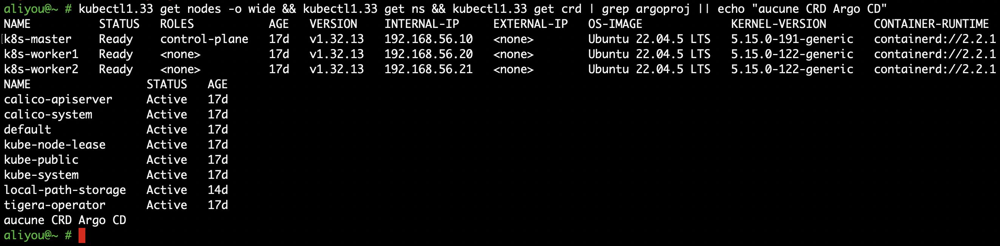

Le projet démarre sur un cluster kubeadm de trois nœuds `Ready` (Kubernetes v1.32.13) qui ne contient que ses composants système : Calico (CNI), local-path-provisioner (stockage) et les namespaces Kubernetes par défaut. Aucun namespace `argocd` et aucune CRD `argoproj.io` : Argo CD n'est pas encore installé.

Cet état initial est vérifié plutôt que supposé, pour deux raisons. D'abord, les CRDs d'Argo CD sont des ressources cluster-scoped : une installation antérieure laisserait des CRDs d'une autre version qui cohabiteraient mal avec la version installée ensuite (v3.4.9, épinglée). Ensuite, ce point de départ sert de référence pour prouver la reproductibilité du projet : la réinitialisation du laboratoire devra ramener le cluster exactement à cet état.

### Capacité et réseau : les contraintes qui orientent la conception

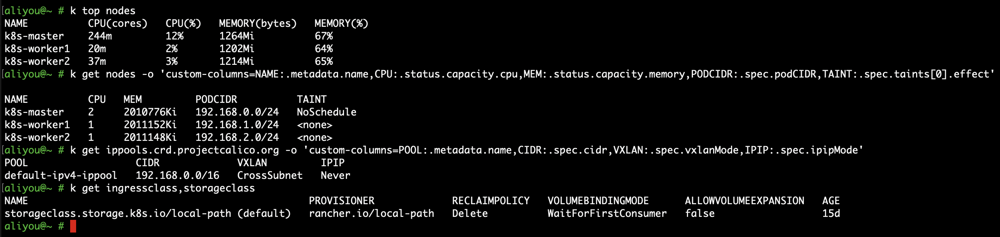

Cette capture relève les contraintes sur lesquelles reposent trois choix du projet (`k` est un alias de `kubectl1.33`, client choisi pour respecter la compatibilité à une version mineure près avec l'API server 1.32).

* **Capacité.** Les workers disposent d'1 vCPU et de 2 Gio chacun, dont 64 à 65 % de mémoire déjà occupée au repos, et le control-plane porte le taint `NoSchedule` : tout ce que le projet déploie tiendra sur les deux workers. D'où Argo CD en mode non-HA et des `requests`/`limits` bornés pour `podinfo`.
* **Réseau.** Calico alloue les IP des pods dans le pool `192.168.0.0/16`, avec encapsulation VXLAN uniquement entre sous-réseaux différents (`CrossSubnet`) ; les nœuds partageant `192.168.56.0/24`, le trafic entre pods est routé sans encapsulation. Les `PODCIDR` affichés par nœud ne sont pas utilisés : Calico gère sa propre IPAM. Le pool englobe le réseau des nœuds : ce chevauchement est documenté comme contrainte connue, sans correction, le CNI étant hors du périmètre du projet.
* **Exposition.** La dernière commande ne renvoie aucune IngressClass, seulement la StorageClass `local-path` : il n'existe aucun point d'entrée HTTP dans le cluster, et aucun LoadBalancer n'est disponible hors cloud. L'interface d'Argo CD sera donc consultée par `kubectl port-forward`, sans rien exposer au-delà du poste d'administration.

Le détail et les autres contraintes relevées (dont la latence d'etcd) figurent dans [docs/ARCHITECTURE.md](docs/ARCHITECTURE.md).

### Manifestes de podinfo validés avant tout déploiement

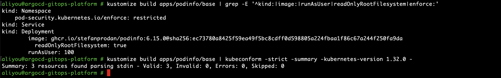

Les manifestes de `podinfo` (`apps/podinfo/base/`) sont rendus par Kustomize puis validés contre le schéma exact de Kubernetes 1.32, sans aucun accès au cluster : rien n'est appliqué à la main, c'est Argo CD qui déploiera ce rendu. La première commande extrait du rendu les propriétés qui portent la sécurité de l'application :

* **`enforce: restricted`** sur le namespace : Pod Security Admission refuse tout pod qui tournerait en root, garderait des capabilities ou autoriserait l'escalade de privilèges. C'est une seconde barrière, indépendante des manifestes : même une erreur commitée dans Git ne pourrait pas lancer un pod privilégié dans ce namespace.
* **Image épinglée par digest** : le tag `6.15.0` reste lisible, mais c'est le digest `sha256:…` de l'index multi-architecture qui fait foi. Un tag republié côté registre ne peut pas changer silencieusement ce qui tourne dans le cluster, et le déploiement est reproductible.
* **`runAsUser: 100`** : l'image déclare un utilisateur par son nom (`USER app`), que le kubelet ne peut pas vérifier ; sans UID numérique, `runAsNonRoot` ferait refuser le pod. L'UID 100 a été relevé dans l'image elle-même.
* **`readOnlyRootFilesystem: true`** : un attaquant qui prendrait la main sur le processus ne pourrait ni modifier le binaire ni déposer d'outil ; seul un volume `emptyDir` de 16 Mio monté sur `/data` est inscriptible. Ce fonctionnement a été testé en local avant d'être déclaré.

La seconde commande valide les trois ressources en mode `-strict` : un champ inconnu, par exemple une faute de frappe dans `readOnlyRootFilesystem`, est rejeté au lieu d'être ignoré silencieusement par l'API server, ce qui aurait désactivé le durcissement sans aucun message d'erreur.

### Argo CD v3.4.9 installé de façon déclarative et épinglée

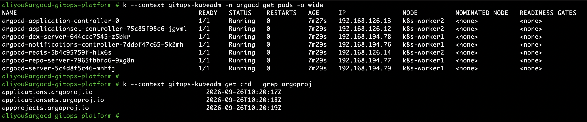

Argo CD est installé par la seule opération impérative du projet :

```
kustomize build argocd/bootstrap | kubectl1.33 --context gitops-kubeadm apply --server-side -f -
```

`argocd/bootstrap/` référence le manifeste officiel non modifié, épinglé par le SHA du commit du tag `v3.4.9` (un tag Git peut être déplacé, un commit non), et y ajoute le namespace `argocd`. L'installation a d'abord été simulée avec `--dry-run=server`, qui fait passer chaque objet par l'authentification, le RBAC, la validation et l'admission de l'API server sans rien écrire dans etcd.

`--server-side` n'est pas un choix de confort : en apply classique, `kubectl` recopie chaque objet dans l'annotation `last-applied-configuration`, limitée à 256 Kio, alors que les CRDs `applications` (397 Ko) et `applicationsets` (1,39 Mo) la dépassent. Avec Server-Side Apply, c'est l'API server qui calcule la fusion et suit la propriété de chaque champ (`managedFields`).

La capture montre les sept composants `Running` sans redémarrage et les trois CRDs qui étendent l'API Kubernetes (`Application`, `ApplicationSet`, `AppProject`). Aucun pod ne tourne sur `k8s-master` : le taint `NoSchedule` du control-plane repousse toute la charge sur les workers, conformément à [l'architecture](docs/ARCHITECTURE.md). Le namespace `argocd` impose le profil Pod Security `restricted`, et les sept pods ont été admis : tous tournent sans root, sans capability et avec une racine en lecture seule. Les sept NetworkPolicies du manifeste officiel sont appliquées par Calico et cloisonnent les composants dès l'installation.

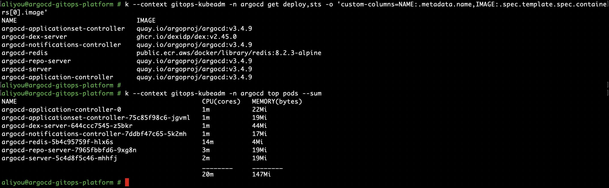

La première commande liste l'image de chaque composant : `quay.io/argoproj/argocd:v3.4.9` partout, plus Dex et Redis aux versions fixées par ce manifeste. La version qui tourne est donc bien celle décidée, et non une `latest` récupérée au passage.

La seconde mesure le coût réel d'Argo CD au repos, sans aucune Application : environ 150 Mio pour sept pods répartis sur deux workers. Dex, le connecteur SSO, en représente à lui seul environ 45 Mio alors qu'aucun SSO n'est configuré : c'est la première économie possible si la mémoire venait à manquer. La mesure se fait par pod (`top pods`) et non par nœud : le *working set* d'un nœud inclut une partie du cache disque du noyau, qui a justement baissé pendant le téléchargement des images, et ne reflète pas la consommation d'Argo CD.

### Accès à Argo CD sans exposition et sécurisation du compte admin

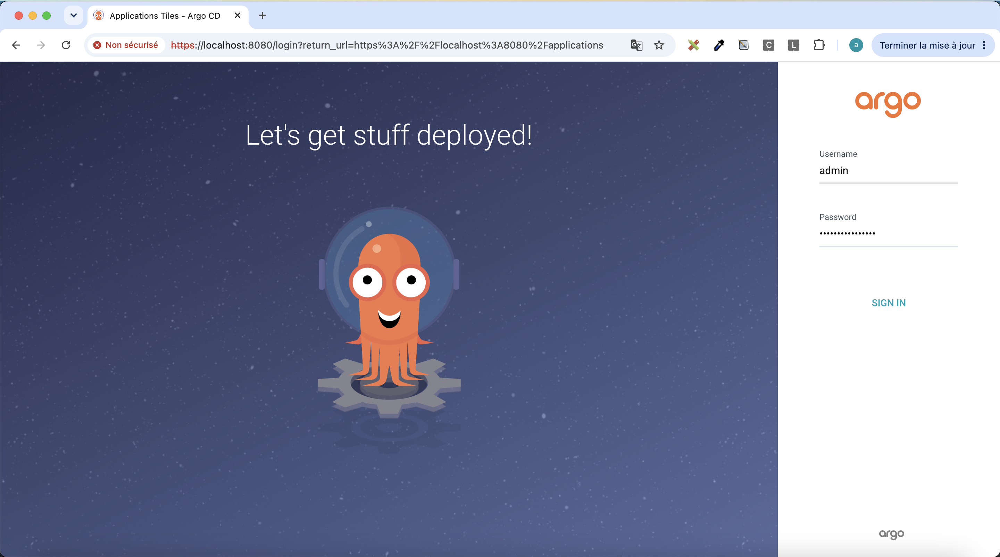

L'interface n'est exposée ni par NodePort, ni par Ingress, ni par LoadBalancer : le Service `argocd-server` reste en `ClusterIP`. On y accède par un tunnel ouvert à la demande depuis le poste d'administration :

```
kubectl1.33 --context gitops-kubeadm -n argocd port-forward svc/argocd-server 8080:443
```

Le tunnel n'écoute que sur `127.0.0.1` et n'existe que le temps de la commande ; l'ouvrir exige un kubeconfig valide, donc une authentification auprès de l'API Kubernetes. La barre d'adresse signale « Non sécurisé » : la connexion est chiffrée en TLS, mais le certificat est auto-signé, généré par Argo CD à l'installation, et aucune autorité reconnue n'en garantit l'identité. C'est un compromis de laboratoire assumé : en production, le certificat serait émis par cert-manager et une autorité reconnue.

Le mot de passe initial, généré aléatoirement dans le Secret `argocd-initial-admin-secret`, n'a jamais été affiché : il a été extrait, décodé et envoyé directement dans le presse-papiers (`kubectl get secret ... | base64 -d | pbcopy`), puis collé dans le champ masqué. Base64 n'est qu'un encodage : quiconque peut lire les Secrets du namespace pourrait le lire, d'où les étapes suivantes.

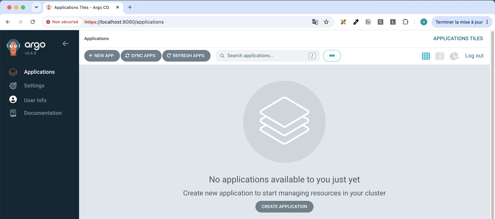

Une fois connecté, le tableau de bord confirme la version v3.4.9 et l'absence de toute Application. C'est le point de départ voulu : tant qu'aucune Application n'est déclarée, Argo CD ne lit aucun dépôt et ne modifie aucune ressource du cluster.

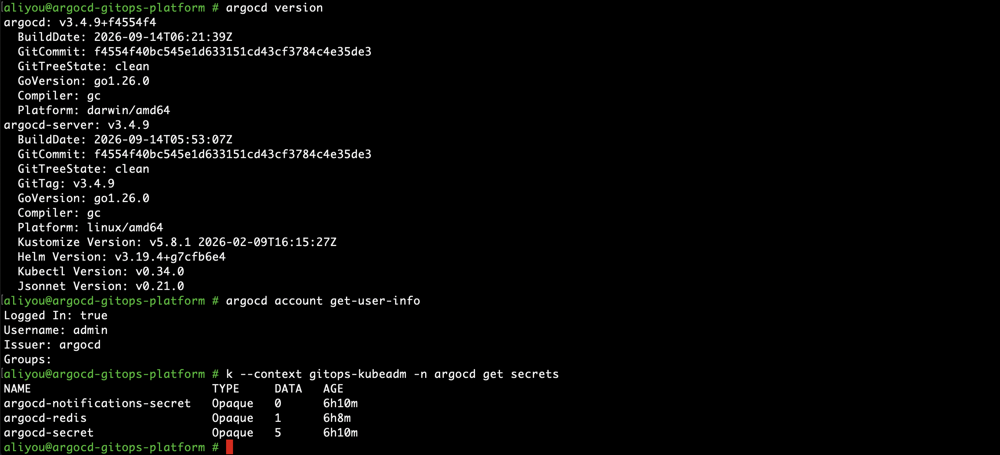

La connexion en CLI (`argocd login localhost:8080 --username admin --insecure`) passe par le même tunnel ; le mot de passe est saisi à une invite sans écho, jamais en argument de commande, où il resterait visible par `ps` et dans l'historique du shell. Le mot de passe admin a ensuite été changé (`argocd account update-password`) : seul son hash bcrypt est conservé, dans `argocd-secret`. Le Secret initial, devenu inutile, a été supprimé comme le recommande la documentation officielle ; Argo CD ne le régénère pas.

La capture vérifie trois points : le client et le serveur sont construits depuis le même commit (`f4554f40…`), celui épinglé dans `argocd/bootstrap/` ; la session CLI est authentifiée (`Logged In: true`) ; `argocd-initial-admin-secret` ne figure plus parmi les Secrets. Elle montre aussi que le serveur embarque Kustomize v5.8.1, la version utilisée pour valider les manifestes en local : le rendu vérifié avant commit est celui qu'Argo CD appliquera.

### podinfo déployé par Argo CD depuis Git (App of Apps)

Un seul fichier est appliqué à la main, une seule fois : `argocd/root-app.yaml`. Il crée l'AppProject `platform` et l'Application racine `root`, qui surveille le dossier `argocd/` du dépôt sur GitHub. `root` y trouve l'AppProject et l'Application `podinfo`, qui surveille à son tour `apps/podinfo/base`. Tout le reste découle de Git :

```
kubectl apply -f argocd/root-app.yaml  (une fois)
  └─ Application root (projet platform) ── lit argocd/
       ├─ AppProject podinfo
       └─ Application podinfo (projet podinfo) ── lit apps/podinfo/base
            └─ Namespace, Service, Deployment → ReplicaSet → 2 pods
```

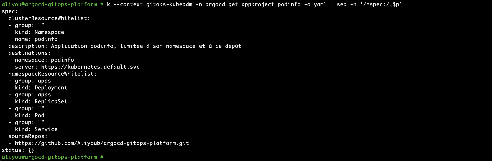

L'AppProject `podinfo` borne ce que l'application peut faire, indépendamment de ce que contiennent ses manifestes : une seule source (ce dépôt), une seule destination (le namespace `podinfo` du cluster local), et une liste fermée de types. Pour les ressources cluster-scoped, seul le Namespace **nommé** `podinfo` est autorisé : Argo CD ne confronte pas les objets cluster-scoped aux destinations, et sans le champ `name` le projet pourrait créer n'importe quel namespace, `kube-system` compris. Un Secret, un Role ou un ClusterRole ajouté dans `apps/podinfo/` serait refusé à la synchronisation. L'Application racine a son propre projet, `platform`, qui ne peut créer que des AppProjects et des Applications dans `argocd` ; le projet `default`, permissif, n'est utilisé par aucune Application.

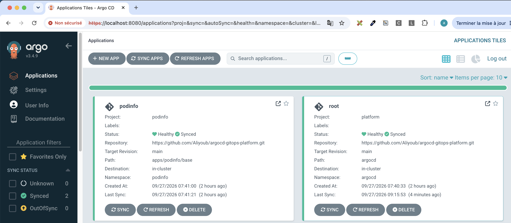

Les deux Applications sont `Synced` (le cluster correspond au dernier commit de `main`) et `Healthy` (les ressources fonctionnent : pour un Deployment, les replicas sont disponibles et leurs sondes répondent). Elles se synchronisent automatiquement avec `prune` (ce qui est retiré de Git est supprimé du cluster) et `selfHeal` (toute modification faite hors Git est annulée). `podinfo` porte le finalizer de suppression en cascade ; `root` ne le porte pas, pour qu'une suppression accidentelle du point d'entrée ne détruise pas les applications.

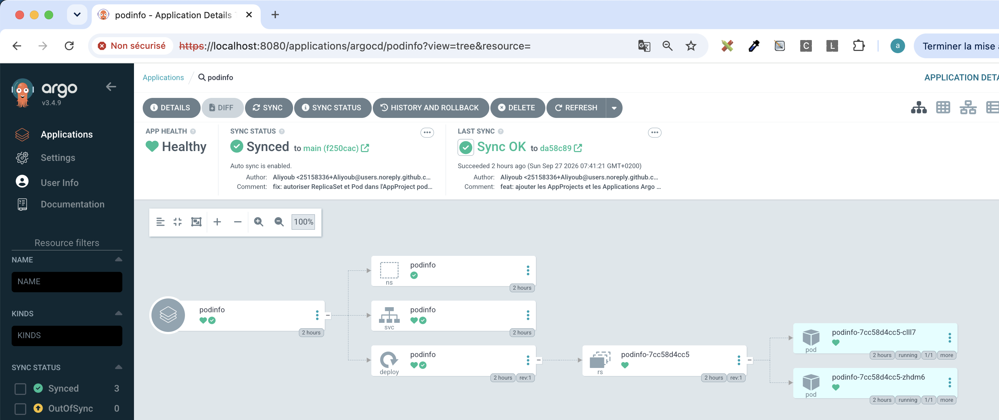

L'arbre montre ce qu'Argo CD applique (Namespace, Service, Deployment) et ce que Kubernetes en dérive (ReplicaSet, pods), relié par les `ownerReferences`. Les deux pods tournent sur des workers différents, sous Pod Security Admission `restricted`, admis dès la première tentative.

Cet arbre a d'abord été incomplet : il s'arrêtait au Deployment. Le code d'Argo CD (`controller/appcontroller.go`) écarte de l'arbre tout enfant dont le type n'est pas autorisé par l'AppProject, et la liste blanche ne contenait que `Deployment` et `Service`. La correction, l'ajout de `ReplicaSet` et `Pod`, a été le premier changement réellement GitOps du projet : un commit poussé, aucune commande `kubectl`, et `root` a mis à jour l'AppProject 92 secondes plus tard, au polling suivant. Le compromis est assumé : la même liste autorise aussi à déployer ces types depuis Git, dans le même namespace et toujours sous PSA `restricted`. En haut de la capture, `Synced to main (f250cac)` alors que la dernière opération date de `da58c89` : ce commit ne modifiait pas `apps/podinfo/base`, l'état était donc déjà conforme et aucune nouvelle synchronisation n'a été nécessaire.

### Scénarios GitOps : déploiement, self-heal, prune, rollback, historique

Cinq scénarios enchaînés sur `podinfo` rejouent ce qui fait l'intérêt de GitOps. Ils sont détaillés dans [docs/GITOPS-SCENARIOS.md](docs/GITOPS-SCENARIOS.md), avec pour chacun l'objectif, l'état initial, l'action, le comportement attendu, le comportement réellement observé (horodatages compris) et l'explication.

| # | Scénario | Déclencheur | Résultat observé |
| - | -------- | ----------- | ---------------- |
| 1 | Déploiement continu | commit Git | nouvelle version déployée sans `kubectl`, deux pods prêts à chaque instant |
| 2 | Self-heal | `kubectl scale` manuel, hors Git | modification annulée en 2 à 3 s |
| 3 | Prune | manifeste retiré de Git | Service supprimé du cluster, Deployment intact |
| 4 | Rollback | `git revert` | Service rétabli 34 s après le push, historique conservé |
| 5 | Historique | lecture | chaque déploiement relié à son commit, lancé par la politique automatique |

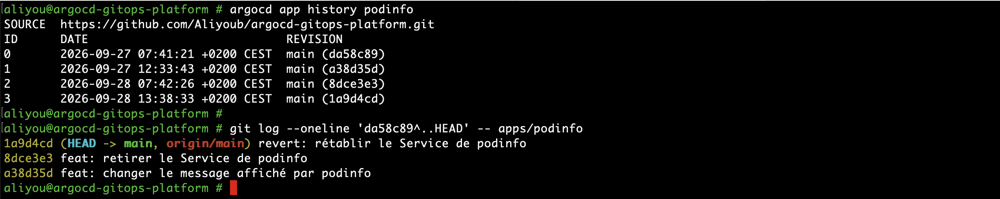

Les quatre déploiements enregistrés par Argo CD correspondent exactement aux commits qui ont modifié l'application ; les corrections du self-heal, qui réappliquent une révision déjà déployée, n'en créent pas. Cet historique est un journal des déploiements, pas la source de vérité : la référence reste `git log`, complet et relu en pull request.

## Licence

[MIT](LICENSE)
