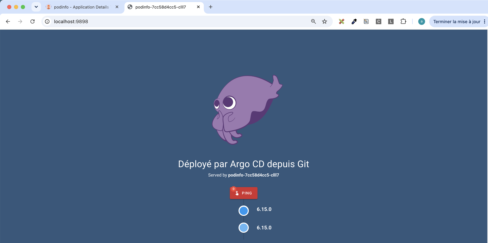
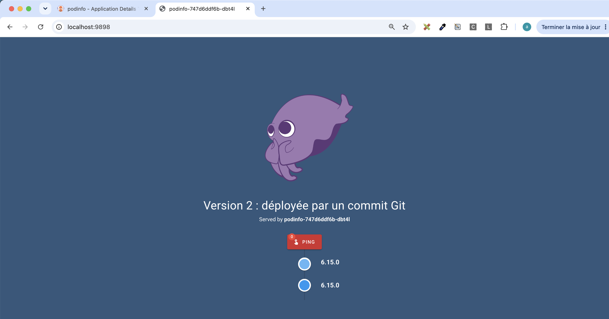
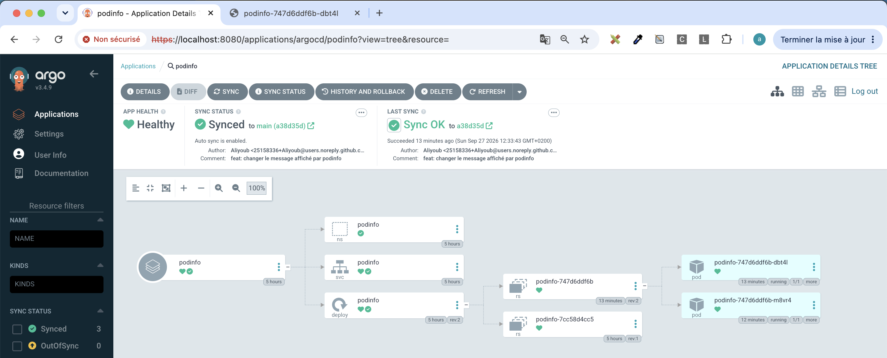
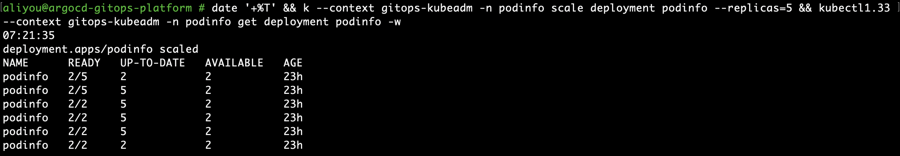
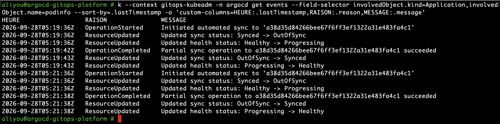
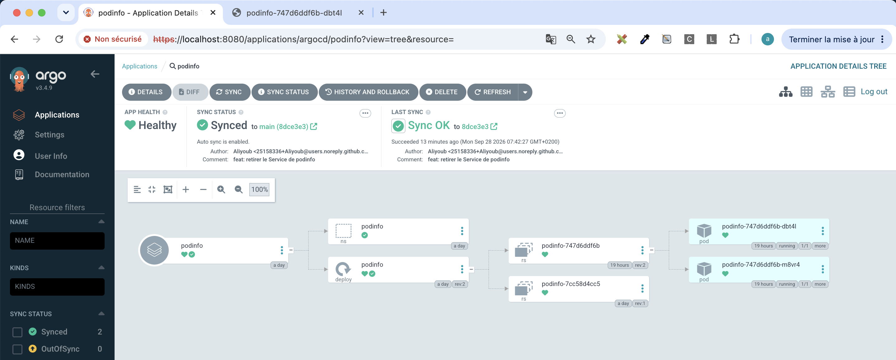
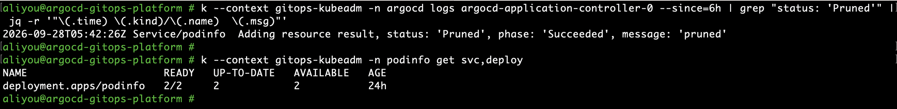
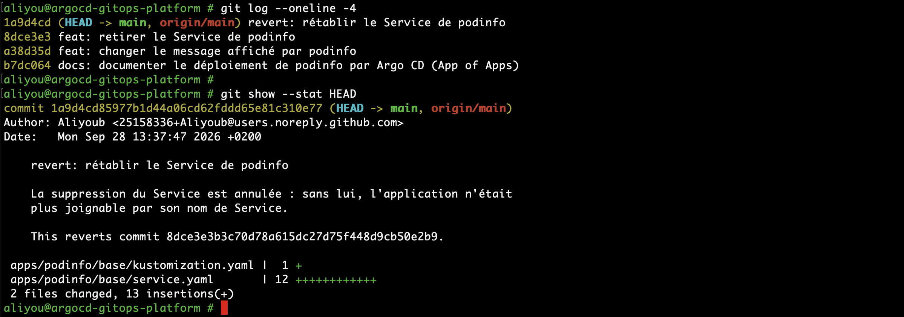
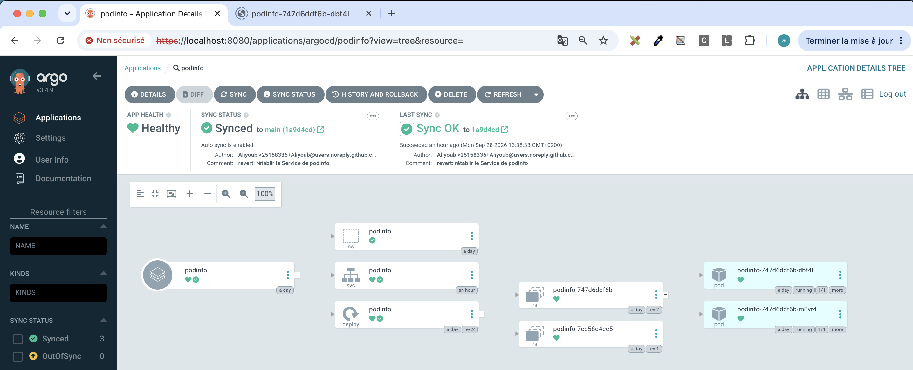
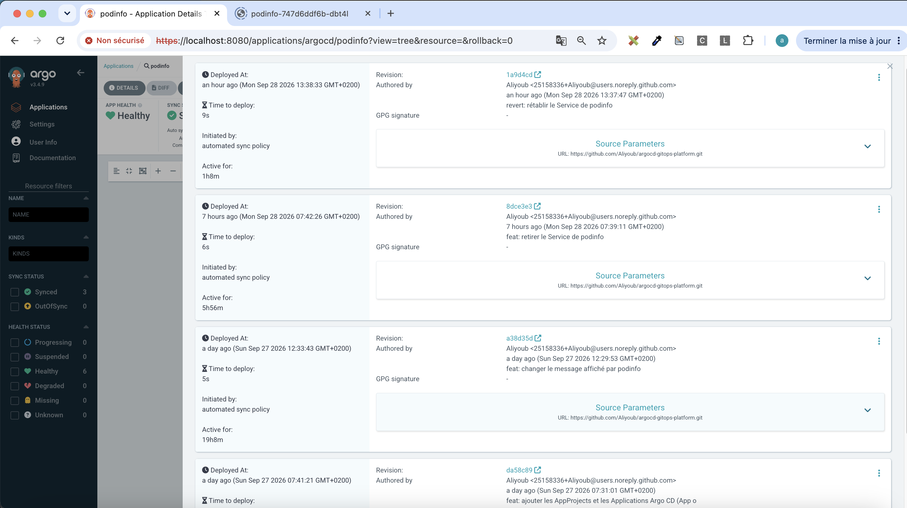

# Scénarios GitOps

Ce document rejoue les comportements qui font l'intérêt de GitOps sur l'application `podinfo`, gérée par Argo CD v3.4.9 (synchronisation automatique, `prune`, `selfHeal`). Les scénarios s'enchaînent : chacun part de l'état laissé par le précédent. Les horodatages et les sorties sont ceux réellement observés le 2026-09-27 ; rien n'est reconstitué.

| # | Scénario | Déclencheur | Résultat |
| - | -------- | ----------- | -------- |
| 1 | Déploiement continu | commit Git | nouvelle version déployée sans `kubectl`, sans interruption |
| 2 | Self-heal | `kubectl scale` manuel, hors Git | modification annulée en 2 à 3 secondes |
| 3 | Prune | manifeste supprimé de Git | ressource supprimée du cluster, le reste intact |
| 4 | Rollback | `git revert` | ressource rétablie en 34 s, historique conservé |
| 5 | Historique | lecture | chaque déploiement relié à son commit |

## Scénario 1 — Déploiement continu

**Objectif.** Montrer qu'un commit suffit à déployer une nouvelle version : aucune commande `kubectl`, aucun accès au cluster pour la personne qui livre, et une mise à jour sans interruption de service.

**État initial.** Application `podinfo` `Synced` sur `b7dc064`, `Healthy`. Deux pods du ReplicaSet `7cc58d4cc5` (révision 1) affichent le message « Déployé par Argo CD depuis Git ».



**Action.** Commit `a38d35d` (`feat: changer le message affiché par podinfo`), une ligne modifiée dans `apps/podinfo/base/deployment.yaml` :

```diff
             - name: PODINFO_UI_MESSAGE
-              value: "Déployé par Argo CD depuis Git"
+              value: "Version 2 : déployée par un commit Git"
```

Une variable d'environnement modifie le modèle de pod (`spec.template`) : Kubernetes crée un nouveau ReplicaSet et remplace les pods, ce qu'un simple changement du nombre de replicas ne ferait pas.

**Comportement attendu.** Au polling suivant (120 s + jitter de 0 à 60 s), Argo CD détecte l'écart, synchronise automatiquement, puis Kubernetes remplace les pods un par un : `maxUnavailable: 0` interdit d'arrêter un pod avant qu'un nouveau soit prêt, `maxSurge: 1` autorise un pod supplémentaire pendant la transition.

**Comportement observé.**

| Heure | Événement |
| ----- | --------- |
| 12:29:55 | push de `a38d35d` |
| 12:33:38 | détection (`Synced -> OutOfSync`) et `Initiated automated sync to 'a38d35d…'` |
| 12:33:43 | synchronisation réussie (5 s), ReplicaSet `747d6ddf6b` (révision 2) créé, santé `Progressing` |
| 12:34:02 | premier pod v2 prêt |
| 12:34:29 | premier pod v1 arrêté, second pod v2 en création |
| 12:34:49 | second pod v2 prêt |
| 12:35:14 | santé `Healthy` |
| 12:35:20 | dernier pod v1 supprimé |

Deux pods prêts à chaque instant. Les événements `Readiness probe failed` relevés pendant la transition confirment le bon fonctionnement : `connection refused` sur les pods neufs (la sonde part avant que le serveur HTTP écoute, le pod n'est donc pas déclaré prêt trop tôt), `503` sur le pod en arrêt (podinfo se retire volontairement du Service avant de s'arrêter).

La détection a pris 3 min 43 s, au-delà des 180 s théoriques. Explication plausible, non vérifiée : le repo-server met en cache la révision résolue d'une branche pendant la durée de `timeout.reconciliation` ; une vérification peut tomber sur la révision précédente, encore en cache, et le commit n'est vu qu'au cycle suivant. Le bouton *Refresh* (relecture immédiate de Git) ou un webhook GitHub, inaccessible ici puisque le cluster n'est pas exposé, supprime ce délai. Les 27 s entre « pod prêt » et « pod v1 arrêté », pour 3 s de `minReadySeconds`, sont cohérentes avec la latence du control-plane relevée dans [ARCHITECTURE.md](ARCHITECTURE.md), sans que ce lien soit vérifié.

**État final.** `Synced` sur `a38d35d`, `Healthy`. Deux pods du ReplicaSet `747d6ddf6b` (révision 2), un par worker ; le ReplicaSet `7cc58d4cc5` de la révision 1 est conservé à zéro pod (`revisionHistoryLimit: 3`).





**Explication.** La personne qui livre n'a besoin que d'un droit d'écriture sur le dépôt ; elle ne détient ni kubeconfig ni credential du cluster. Le changement est tracé (auteur, message, diff) et relu avant d'atteindre la branche suivie. Argo CD applique exactement le commit, et Kubernetes se charge du remplacement progressif. Le ReplicaSet de la révision 1 reste disponible, mais le retour arrière passera par Git (scénario 4) : c'est Git, et non l'état du cluster, qui fait foi.

## Scénario 2 — Self-heal

**Objectif.** Montrer qu'une modification faite hors Git ne tient pas : Argo CD la détecte et remet le cluster dans l'état décrit par Git. L'action est une modification manuelle, volontaire et annoncée comme telle, seule exception à la règle « tout passe par Git », précisément pour prouver que la règle est appliquée par la machine.

**État initial.** `Synced` sur `a38d35d`, `Healthy`, deux replicas du ReplicaSet `747d6ddf6b`.

**Action.** Passage manuel à cinq replicas, hors Git :

```
kubectl1.33 --context gitops-kubeadm -n podinfo scale deployment podinfo --replicas=5
```

**Comportement attendu.** Le contrôleur d'Argo CD observe en continu (watch) les ressources vivantes, contrairement au dépôt Git qu'il interroge périodiquement : l'écart sur `spec.replicas` est détecté immédiatement. Avec `selfHeal: true`, la correction part après un délai initial de 2 s (`--self-heal-backoff-timeout-seconds`, vérifié dans le code de la v3.4.9), multiplié par 3 à chaque récidive jusqu'à 5 minutes, pour ne pas lutter indéfiniment contre un autre acteur.

**Comportement observé.**



| Heure (UTC, horloge des workers) | Événement |
| -------------------------------- | --------- |
| 05:21:35 | `kubectl scale --replicas=5` (07:21:35 heure locale, capture ci-dessus) |
| 05:21:36 | `Synced -> OutOfSync`, `Initiated automated sync to 'a38d35d…'` |
| 05:21:38 | `Partial sync operation to a38d35d… succeeded`, `OutOfSync -> Synced`, `Healthy` |

Mesure indépendante des horloges, sur la seule horloge de l'API server : `Scaled up replica set podinfo-747d6ddf6b from 2 to 5` à 05:21:25, `Scaled down … from 5 to 2` à 05:21:27. La modification manuelle a vécu 2 secondes ; les trois pods supplémentaires ont été supprimés avant d'être prêts (`READY` n'a jamais dépassé `2/5`), aucun trafic n'a donc été servi par un état non déclaré.



Le journal montre deux self-heals, à 05:19:36 et 05:21:36 : le `scale` a été lancé deux fois, et corrigé deux fois. Chaque synchronisation vise `a38d35d`, le commit déjà déployé : Argo CD restaure l'état de Git, il ne livre rien de nouveau. `Partial sync` indique que seule la ressource qui a dérivé, le Deployment, a été réappliquée.

Les horodatages de l'API server (hébergé sur `k8s-master`) retardent d'environ 10 à 15 s sur ceux du contrôleur Argo CD (hébergé sur `k8s-worker2`) : les horloges des nœuds ne sont pas synchronisées. La chronologie ci-dessus est donc exprimée sur l'horloge des workers, alignée sur celle du poste d'administration (voir [ARCHITECTURE.md](ARCHITECTURE.md)).

**État final.** `Synced` sur `a38d35d`, `Healthy`, deux replicas.

**Explication.** Sans self-heal, un correctif appliqué à la main en urgence resterait en place sans trace dans Git : le dépôt ne décrirait plus la réalité, et le prochain déploiement écraserait ce correctif sans que personne ne le sache. Avec self-heal, le seul chemin durable pour modifier le cluster est un commit, donc une modification tracée et relue. La contrepartie est à connaître : un autre contrôleur qui modifie légitimement un champ géré par Argo CD, par exemple un HorizontalPodAutoscaler sur `spec.replicas`, entrerait en conflit avec lui ; on déclare alors ce champ dans `ignoreDifferences`.

## Scénario 3 — Prune

**Objectif.** Montrer que retirer un manifeste de Git retire la ressource du cluster. Sans `prune`, Argo CD signalerait la ressource en trop (`OutOfSync`) sans la supprimer, et le cluster accumulerait des objets que plus personne ne déclare.

**État initial.** `Synced` sur `a38d35d`, `Healthy`. Le Service `podinfo` existe (nœud `svc` de l'arbre, [scénario 1](#scénario-1--déploiement-continu)).

**Action.** Commit `8dce3e3` (`feat: retirer le Service de podinfo`) : suppression de `apps/podinfo/base/service.yaml` et de sa ligne dans `kustomization.yaml`. Le rendu ne contient plus que le Namespace et le Deployment.

**Comportement attendu.** Au polling suivant, Argo CD constate que le Service existe dans le cluster mais plus dans Git ; avec `prune: true`, la synchronisation automatique le supprime. Avec `PruneLast=true`, la suppression est placée dans une phase distincte, après l'application de tout le reste. Le Deployment et ses pods ne sont pas touchés.

**Comportement observé.**

| Heure (UTC) | Événement |
| ----------- | --------- |
| 05:39:13 | push de `8dce3e3` |
| 05:42:20 | détection (`Synced -> OutOfSync`), `Initiated automated sync to '8dce3e3…'` ; plan : Namespace et Deployment en phase `Sync/0` (`obj->obj`), Service en phase `Sync/1` (`obj->nil`, à supprimer) |
| 05:42:26 | `Service/podinfo … status: 'Pruned', phase: 'Succeeded', message: 'pruned'` ; opération réussie |
| 05:42:26 | seconde synchronisation automatique, limitée au Service (`Partial sync`) |
| 05:42:27 | `OutOfSync -> Synced`, `Healthy` |



L'arbre ne contient plus de nœud `svc` ; le Deployment, ses deux ReplicaSets et ses pods sont inchangés.



La preuve de la suppression vient du journal du contrôleur, et non du résultat de l'opération : Argo CD ne conserve dans `status.operationState` que le résultat de la dernière opération, et la seconde synchronisation, partielle et sans rien à faire (`Duration: 0s`, `no more tasks`), a écrasé celui de la première. Explication plausible de cette seconde synchronisation, non vérifiée : la suppression d'un objet Kubernetes est asynchrone ; à la fin de la première opération, le contrôleur voyait encore le Service en cours de suppression, l'a considéré comme un écart et a relancé une synchronisation ciblée.

**État final.** `Synced` sur `8dce3e3`, `Healthy`. Plus de Service `podinfo` ; Deployment à `2/2`. L'application n'est plus joignable par son nom de Service.

**Explication.** `prune` fait de Git l'inventaire complet de l'application : ce qui n'y figure plus disparaît du cluster, sans nettoyage manuel ni ressource orpheline. C'est aussi le réglage le plus risqué : un fichier supprimé par erreur, un chemin mal renseigné ou un rendu Kustomize vide supprimeraient des ressources en production. Les garde-fous du projet : `allowEmpty: false` refuse une synchronisation qui supprimerait toutes les ressources, `PruneLast` retarde les suppressions après l'application du reste, et la revue de pull request doit porter aussi sur les suppressions. Le scénario suivant montre comment réparer une suppression erronée.

## Scénario 4 — Rollback par `git revert`

**Objectif.** Montrer qu'en GitOps, revenir en arrière, c'est faire un commit. La suppression du Service au scénario 3 est traitée comme une erreur de production : l'application n'est plus joignable par son nom de Service.

**État initial.** `Synced` sur `8dce3e3`, `Healthy`, aucun Service `podinfo`.

**Action.** Commit `1a9d4cd` (`revert: rétablir le Service de podinfo`), produit par `git revert --no-commit 8dce3e3` puis un message en français qui conserve la référence `This reverts commit 8dce3e3…`. Il applique l'inverse exact du commit fautif : `service.yaml` recréé, sa ligne remise dans `kustomization.yaml`.



**Comportement attendu.** Argo CD constate que le Service est déclaré dans Git mais absent du cluster, et le recrée ; le Service retrouve les pods existants grâce à son sélecteur (`app.kubernetes.io/name`, `app.kubernetes.io/instance`), inchangé.

**Comportement observé.** Push à 13:37:59 (heure locale), synchronisation réussie à 13:38:33, soit 34 s plus tard : un *Refresh* a évité d'attendre le polling. Le Service est recréé, et son EndpointSlice liste les deux adresses des pods (`192.168.126.16`, `192.168.194.81`) : il route de nouveau le trafic. Le tunnel `port-forward svc/podinfo` fonctionne de nouveau et sert toujours la version 2, puisque seule la suppression du Service a été annulée.



Le nœud `svc` est revenu, plus jeune que les autres ressources : c'est un objet neuf. Il a d'ailleurs reçu une nouvelle ClusterIP (`10.111.146.31`) ; les clients qui l'appellent par son nom DNS (`podinfo.podinfo.svc`) n'en voient rien, seuls ceux qui auraient codé l'adresse en dur seraient affectés.

**État final.** `Synced` sur `1a9d4cd`, `Healthy`, Service et Deployment présents.

**Explication.** `git revert` crée un commit ordinaire : il passe par le même circuit que n'importe quel changement (revue, CI, polling, synchronisation), et l'historique garde l'erreur et sa correction, avec leurs auteurs et leurs dates. Les alternatives sont écartées volontairement :

* `git reset` suivi d'un `push --force` réécrirait un historique déjà publié : les copies des autres développeurs divergeraient, et la trace de l'erreur disparaîtrait ;
* le bouton *Rollback* d'Argo CD redéploie une révision précédente, mais il est refusé tant que la synchronisation automatique est active ; même en la désactivant, le cluster ne correspondrait plus à Git, qui décrirait toujours la version fautive. C'est un outil de dépannage d'urgence, pas le mode de fonctionnement normal.

Le rollback GitOps est donc aussi rapide qu'un déploiement, et aussi traçable.

## Scénario 5 — Historique

**Objectif.** Montrer qu'Argo CD garde la trace de chaque déploiement, et situer cet historique par rapport à celui de Git.

**Action.** Lecture de l'écran *History and Rollback* de l'Application `podinfo`, puis comparaison en ligne de commande avec l'historique Git.

**Comportement attendu.** Une entrée par révision déployée ; les synchronisations qui réappliquent une révision déjà déployée (self-heal, synchronisation partielle) n'en créent pas.

**Comportement observé.**



Quatre déploiements, dans l'ordre antichronologique : `1a9d4cd` (revert, 9 s), `8dce3e3` (retrait du Service, 6 s), `a38d35d` (version 2, 5 s) et `da58c89` (déploiement initial). Chaque entrée relie le déploiement à son commit (auteur, date, message) et indique `Initiated by: automated sync policy` : aucun déploiement n'a été lancé à la main. Les deux self-heals du scénario 2 et la synchronisation partielle du scénario 3 n'y figurent pas. Le champ `GPG signature: -` rappelle que les commits ne sont pas signés ; un AppProject peut exiger des signatures (`signatureKeys`), extension évaluée plus tard.


Les entrées 1 à 3 correspondent exactement aux trois commits qui ont modifié `apps/podinfo`. L'entrée 0, `da58c89`, ne touchait que `argocd/` : c'est le commit qui a créé l'Application, et `podinfo` a alors été déployé pour la première fois à partir de manifestes déjà présents.

**Explication.** L'historique d'Argo CD est un journal des déploiements : il répond à « qu'est-ce qui tourne, depuis quand, et qui l'a déclenché ». Il n'est pas la source de vérité : il est limité (10 entrées par défaut, `spec.revisionHistoryLimit` de l'Application) et disparaît avec l'Application. La référence reste `git log` : complet, attribué à ses auteurs, relu en pull request.

## Bilan

| Propriété | Prouvée par | Garde-fou associé |
| --------- | ------------- | ----------------- |
| Git est le seul chemin pour livrer | scénario 1 : un commit, aucun `kubectl` | revue de pull request, protection de branche |
| Une modification hors Git ne tient pas | scénario 2 : correction en 2 à 3 s | backoff du self-heal, `ignoreDifferences` pour les champs gérés ailleurs |
| Git est l'inventaire complet | scénario 3 : ressource retirée, ressource supprimée | `allowEmpty: false`, `PruneLast`, revue des suppressions |
| Revenir en arrière est un commit | scénario 4 : `git revert`, historique intact | aucun `push --force`, rollback Argo CD réservé à l'urgence |
| Chaque déploiement est tracé | scénario 5 : déploiement relié à son commit | `git log` reste la référence |

Constats annexes, relevés pendant ces scénarios et documentés comme tels : le polling peut dépasser les 180 s théoriques (scénario 1), les horloges des nœuds ne sont pas synchronisées (scénario 2), et le résultat d'une opération peut être écrasé par une synchronisation suivante, le journal du contrôleur faisant alors foi (scénario 3).
